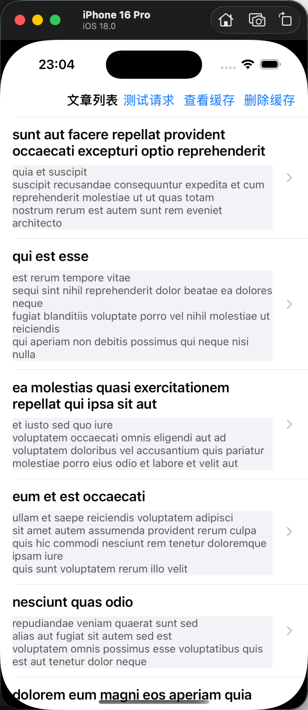
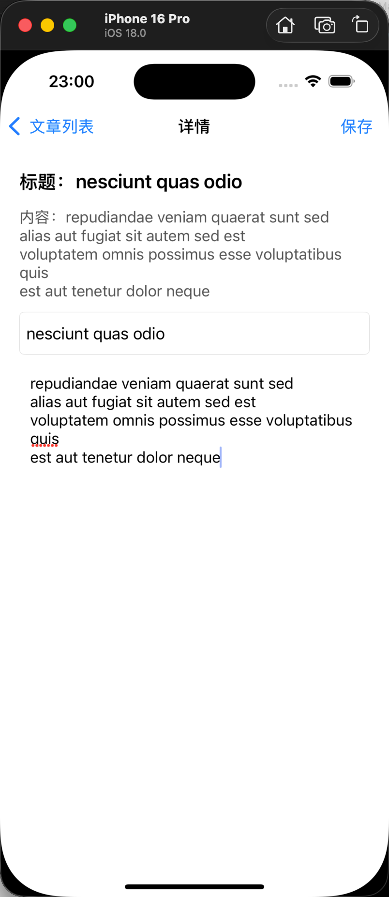
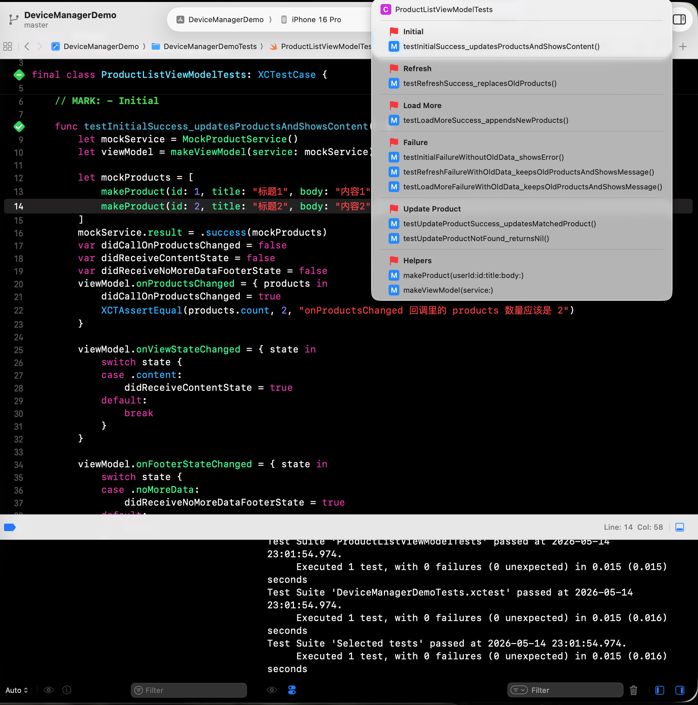

 README.md。

# DeviceManagerDemo
## 项目简介
DeviceManagerDemo 是一个基于 Swift + UIKit 的列表页练习项目，目标是把 Objective-C 中常见的列表业务流程，用 Swift 重新实现，并逐步升级成更清晰、更接近真实项目的工程结构。
项目重点不是 UI 美化，而是列表数据流闭环，包括：网络请求、分页加载、下拉刷新、本地缓存兜底、页面状态管理、请求生命周期控制、详情页编辑回传，以及 MVVM 职责拆分。
当前项目使用公开测试接口 `jsonplaceholder.typicode.com/posts` 作为数据源，用于模拟真实业务中的列表请求、分页加载和详情编辑场景。
---
## 技术栈
- Swift
- UIKit
- UITableView
- URLSession
- Codable / JSONDecoder
- UserDefaults
- MVVM
- Auto Layout
- Closure 回调
- Git 版本管理
---
## 已实现功能
- UITableView 列表展示
- ProductService 网络请求封装
- NetworkError 网络错误分类
- 下拉刷新
- 上拉加载更多
- 本地缓存兜底
- loading / content / empty / error 页面状态管理
- footer loading / noMoreData 底部状态管理
- ProductCell 自定义拆分
- ProductCell 自适应高度
- 详情页展示
- 详情页编辑
- title / body 输入校验
- UITextField / UITextView 表单输入
- 详情页保存后通过 closure 回传
- ProductListViewModel 抽离
- currentTask 请求取消
- currentRequestID / requestID 防旧请求回调污染
- LoadMode 区分 initial / refresh / loadMore
- LoadState 管理当前请求状态
- 根据 LoadMode 区分不同失败场景
- 请求失败时保留旧数据并给出失败提示
---
## 项目结构
```text
DeviceManagerDemo
├── Controllers
│   ├── ProductListViewController.swift
│   └── ProductDetailViewController.swift
│
├── ViewModels
│   └── ProductListViewModel.swift
│
├── Views
│   └── ProductCell.swift
│
├── Models
│   └── Product.swift
│
├── Services
│   ├── ProductService.swift
│   └── NetworkError.swift
│
├── Helpers
│   └── CacheHelper.swift
│
└── SceneDelegate.swift

---

架构说明

项目当前采用轻量 MVVM 拆分。

ProductListViewController

ProductListViewController 负责 UIKit 层，包括：

* tableView 创建和展示
* refreshControl 下拉刷新控件
* loading / empty / error / content UI 渲染
* footer loading / noMoreData UI 渲染
* cell 点击跳转详情页
* 接收 ViewModel 输出并刷新 UI
* 用户滚动触底时触发 loadMore

VC 不再直接管理分页、缓存、请求生命周期和数据更新逻辑。

---

ProductListViewModel

ProductListViewModel 负责列表页数据流，包括：

* products 数据源
* currentPage / pageSize / hasMoreData 分页状态
* LoadMode 加载动作区分
* LoadState 请求状态管理
* currentTask 请求取消
* currentRequestID / requestID 防旧请求回调污染
* loadCache / clearCache / saveCache 缓存流程
* loadData(mode:) 请求主流程
* handleLoadSuccess 成功处理
* handleLoadFailure 失败处理
* updateProduct 处理详情页回传更新

ViewModel 不直接操作 UIKit，不调用 tableView.reloadData()，而是通过闭包把数据和状态输出给 VC。

---

ProductService

ProductService 负责网络层，包括：

* URL 拼接
* URLSession 请求
* error 判断
* response 类型判断
* HTTP statusCode 判断
* data 是否存在判断
* JSONDecoder 解码
* 通过 Result<[Product], Error> 返回请求结果

ProductService 不关心页面展示、不关心分页状态、不关心缓存策略，只负责把一次网络请求转换成成功或失败结果。

---

CacheHelper

CacheHelper 负责本地缓存读写，包括：

* Codable 编码
* UserDefaults 保存
* UserDefaults 读取
* 缓存清除

CacheHelper 不知道具体页面，也不直接刷新 UI，只作为缓存工具使用。

---

核心请求流程

VC 触发请求：

viewModel.loadData(mode: .refresh)

ViewModel 内部请求流程：

1. 如果是 refresh，并且当前旧请求还在飞，先 cancel 旧请求
2. canLoadData 判断当前是否允许请求
3. beginLoading 根据 LoadMode 设置 LoadState
4. makeTargetPage 计算目标页码
5. 生成 requestID
6. 调用 ProductService.fetchList 发起请求
7. 请求回调时先校验 requestID
8. 如果 requestID 已过期，直接丢弃旧回调
9. success 时更新 products / currentPage / hasMoreData / cache
10. failure 时根据 error + mode + products.isEmpty 判断 UI 反馈
11. 通过闭包通知 VC 刷新 UI

---

LoadMode 与 LoadState

LoadMode

LoadMode 表示这一次请求要做什么：

enum LoadMode {
    case initial
    case refresh
    case loadMore
}

* initial：首次进入页面，请求第 1 页
* refresh：用户下拉刷新，请求第 1 页
* loadMore：用户上拉加载更多，请求下一页

LoadMode 是 VC 传给 ViewModel 的动作。

---

LoadState

LoadState 表示 ViewModel 当前正在处于什么请求状态：

private enum LoadState {
    case idle
    case initialLoading
    case refreshing
    case loadingMore
}

* idle：当前没有请求
* initialLoading：正在首次加载
* refreshing：正在下拉刷新
* loadingMore：正在上拉加载更多

LoadState 是 ViewModel 内部状态，不暴露给 VC。

一句话总结：

LoadMode：这次要干嘛。
LoadState：现在正在干嘛。

---

请求并发控制

当前项目通过三层机制控制请求生命周期。

loadState

loadState 用来控制请求入口，避免重复请求和并发请求。

if loadState != .idle {
    return false
}

它解决的是：当前已有请求在进行时，不允许随便再发新的请求。

---

currentTask

currentTask 保存当前正在执行的 URLSessionDataTask。

它用于：

* refresh 时取消旧请求
* 页面销毁时取消未完成请求

currentTask?.cancel()
currentTask = nil

currentTask 管的是请求任务本身。

---

requestID

requestID 用来防止旧请求回调污染数据。

请求发出前：

currentRequestID += 1
let requestID = currentRequestID

请求回来后：

guard requestID == currentRequestID else {
    return
}

如果不相等，说明这是旧请求回调，不能再修改 products、currentPage、cache 或 UI 状态。

一句话总结：

loadState 管能不能发请求。
currentTask 管能不能取消请求。
requestID 管回来后有没有资格写数据。

---

分页加载策略

项目使用 currentPage、pageSize 和 hasMoreData 管理分页。

* initial / refresh 请求第 1 页
* loadMore 请求 currentPage + 1
* refresh 成功后替换 products
* loadMore 成功后 append 到 products
* currentPage 只在请求成功后更新
* hasMoreData 根据本次返回数量是否等于 pageSize 判断

case .initial, .refresh:
    products = list
    currentPage = 1
case .loadMore:
    products.append(contentsOf: list)
    currentPage = targetPage

这样可以避免请求失败后页码提前变化，导致页码错乱。

---

缓存策略

页面首次进入时：

1. 先读取本地缓存
2. 如果有缓存，先展示旧数据
3. 再请求服务器最新数据
4. 请求成功后刷新列表并更新缓存

缓存负责先显示。
网络负责更新。

请求失败时：

* 如果 products 为空，显示 error 空页面
* 如果 products 不为空，继续显示旧数据，并提示失败

这样可以避免弱网或断网时页面直接变成空白。

---

页面状态管理

ViewModel 通过 ViewState 通知 VC 更新主页面状态。

enum ViewState {
    case loading
    case content
    case empty(String)
    case error(String)
}

状态含义：

* loading：首屏加载中
* content：有内容，正常展示 tableView
* empty：请求成功但没有数据
* error：请求失败且没有旧数据可展示

重点区分：

empty 是请求成功，但业务数据为空。
error 是请求失败，并且没有旧数据兜底。
content 是有数据可展示，即使这次刷新失败，也不应该清空页面。

---

Footer 状态管理

ViewModel 通过 FooterState 通知 VC 更新底部状态。

enum FooterState {
    case hidden
    case loadingMore
    case noMoreData
}

状态含义：

* hidden：不显示底部
* loadingMore：正在加载更多
* noMoreData：没有更多数据

FooterState 只负责列表底部状态，不负责主页面状态。

---

失败处理策略

请求失败时，ViewModel 不只看 error，还会结合 LoadMode 和 products 是否为空判断。

error：为什么失败
mode：哪个操作失败
products.isEmpty：当前有没有旧数据可展示

处理原则：

* cancel：主动取消，不当成真正失败
* initial 失败 + 没有旧数据：显示 error 空页面
* initial 失败 + 有缓存：继续显示 content，并提示已显示缓存数据
* refresh 失败 + 有旧数据：继续显示 content，并提示刷新失败
* loadMore 失败 + 有旧数据：继续显示当前列表，并提示加载更多失败
* loadMore 失败不等于没有更多数据

核心原则：

不显示 error 空页，不等于不提示失败。
有旧数据时保留旧数据，但也要给用户失败反馈。

---

ProductService 网络错误分类

ProductService 按请求链路区分错误：

enum NetworkError: Error {
    case invalidURL
    case requestFailed(Error)
    case invalidResponse
    case invalidStatusCode(Int)
    case decodingFailed(Error)
}

错误含义：

* invalidURL：URL 拼接失败，请求还没发出
* requestFailed(Error)：URLSession / 系统网络层失败，比如断网、超时、cancel
* invalidResponse：response 类型异常，或响应不完整
* invalidStatusCode(Int)：HTTP 状态码不是 2xx，比如 404、500
* decodingFailed(Error)：有 data，但 JSON 和 Product 模型对不上

---

Service 层 data / empty / error 边界

Service 层只负责判断网络结果，不直接决定页面状态。

data == nil
→ 没有响应正文
→ Service 返回 failure
data 有值，但 JSON 结构和 Product 对不上
→ JSONDecoder 解码失败
→ Service 返回 failure(decodingFailed)
data 有值，内容是 []
→ JSONDecoder 解码成功
→ Service 返回 success([])
data 有值，内容是正常数组
→ JSONDecoder 解码成功
→ Service 返回 success([Product])

重点：

data nil 不是 empty。
data nil 是失败。
success([]) 才是空数据。

---

详情页编辑回传

详情页通过 closure 将编辑后的 Product 回传给列表页。

var onSave: ((Product) -> Void)?

保存时：

1. 校验 title / body
2. 校验通过后创建 newProduct
3. 通过 onSave 回传
4. ViewModel 根据 product.id 更新 products
5. 保存缓存
6. 通知 VC 刷新列表

这样列表页不需要直接暴露数据修改逻辑，数据更新统一交给 ViewModel。

---

Cell 自适应高度

ProductCell 使用 Auto Layout 和 numberOfLines = 0 支持长文本显示。

UITableView 配置：

tableView.rowHeight = UITableView.automaticDimension
tableView.estimatedRowHeight = 120

ProductCell 中通过底部约束告诉系统内容高度：

bodyLabel.bottomAnchor.constraint(equalTo: contentView.bottomAnchor, constant: -12)

这样 cell 可以根据 title/body 内容自动撑高，避免长文本显示不全。

---

当前项目亮点

* 不是简单 UITableView，而是完整列表数据流闭环
* ViewModel 接管分页、缓存、请求生命周期和失败分支
* VC 只负责 UI、交互、跳转和状态渲染
* ProductService 只负责网络请求和解码
* CacheHelper 只负责缓存读写
* 使用 requestID 防止弱网下旧请求回调污染数据
* 使用 LoadMode 区分 initial / refresh / loadMore
* 请求失败时根据 mode 和旧数据情况做不同反馈
* 列表和详情页都处理了长文本显示问题

---

## Screenshots

| 列表页 | 详情页 |
| --- | --- |
|  |  |

| 单元测试 |
| --- |
|  |

---

## 后续优化

当前项目仍有以下可继续优化的方向：

1. 增加 Toast 组件
   当前失败提示可以继续升级成统一 Toast，而不是简单提示。

2. 增加 emptyData 错误类型
   目前 data == nil 暂时归到 invalidResponse，后续可以单独定义 emptyData，让错误语义更清晰。

3. 改进分页判断
   当前 hasMoreData 使用 list.count == pageSize 推测是否还有更多，后续可以改用服务端返回的 totalPage、totalCount 或 hasMore 字段。

4. 增加更多 ViewModel 单元测试
   当前已通过 ProductServiceProtocol 注入 Mock 服务，对 ProductListViewModel 的部分加载流程进行测试。
   后续可以继续补充 refresh / loadMore / requestID 防旧请求污染 / cancel 请求等分支测试。

5. 增加图片加载
   可以为 ProductCell 增加图片字段，练习异步图片加载、占位图、缓存和 cell 复用错图处理。

6. 缓存升级
   当前使用 UserDefaults 保存轻量缓存，后续可以根据数据量升级到 FileManager 或 CoreData。

7. 局部刷新
   当前 onProductsChanged 后 tableView reloadData，后续可以根据 index 做 reloadRows，提高刷新效率。

---
